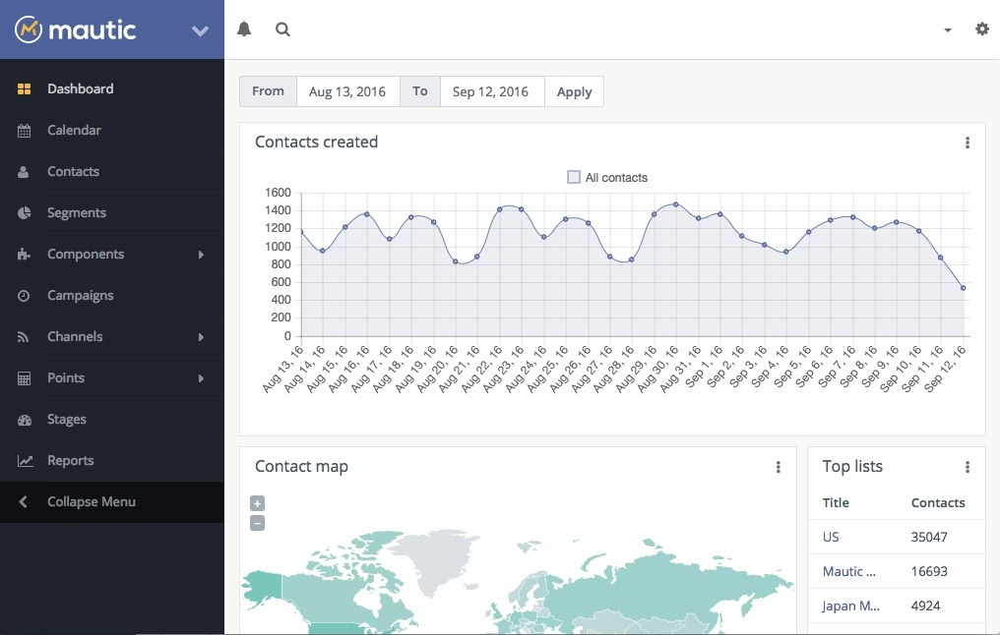

<!--
N.B.: Aquest README ha estat generat automàticament per <https://github.com/YunoHost/apps/tree/master/tools/readme_generator>
NO s'ha de modificar manualment.
-->

# Mautic per YunoHost

[](https://ci-apps.yunohost.org/ci/apps/mautic/)


[](https://install-app.yunohost.org/?app=mautic)

*[Llegeix aquest README en altres idiomes.](./ALL_README.md)*

> *Aquest paquet et permet instal·lar Mautic de forma ràpida i senzilla en un servidor YunoHost.*  
> *Si no tens YunoHost, consulta [la guia](https://yunohost.org/install) per saber com instal·lar-lo.*

## Visió general

With Mautic, website visitors can be tracked and converted into identified contacts using forms. Anonymous and identified contacts can be divided into segments and assigned to campaigns - either on the basis of segments or forms. These campaigns contain workflows to provide the contacts with further information and advertising material or to organize the contacts.


**Versió inclosa:** 6.0.0~ynh1

**Demo:** <https://www.mautic.org/demo>

## Captures de pantalla



## Documentació i recursos

- Lloc web oficial de l'aplicació: <https://www.mautic.org/>
- Documentació oficial per l'administrador: <https://docs.mautic.org/en>
- Repositori oficial del codi de l'aplicació: <https://github.com/mautic/mautic>
- Botiga YunoHost: <https://apps.yunohost.org/app/mautic>
- Reportar un error: <https://github.com/YunoHost-Apps/mautic_ynh/issues>

## Informació per a desenvolupadors

Envieu les pull request a la [branca `testing`](https://github.com/YunoHost-Apps/mautic_ynh/tree/testing).

Per provar la branca `testing`, procedir com descrit a continuació:

```bash
sudo yunohost app install https://github.com/YunoHost-Apps/mautic_ynh/tree/testing --debug
o
sudo yunohost app upgrade mautic -u https://github.com/YunoHost-Apps/mautic_ynh/tree/testing --debug
```

**Més informació sobre l'empaquetatge d'aplicacions:** <https://yunohost.org/packaging_apps>
