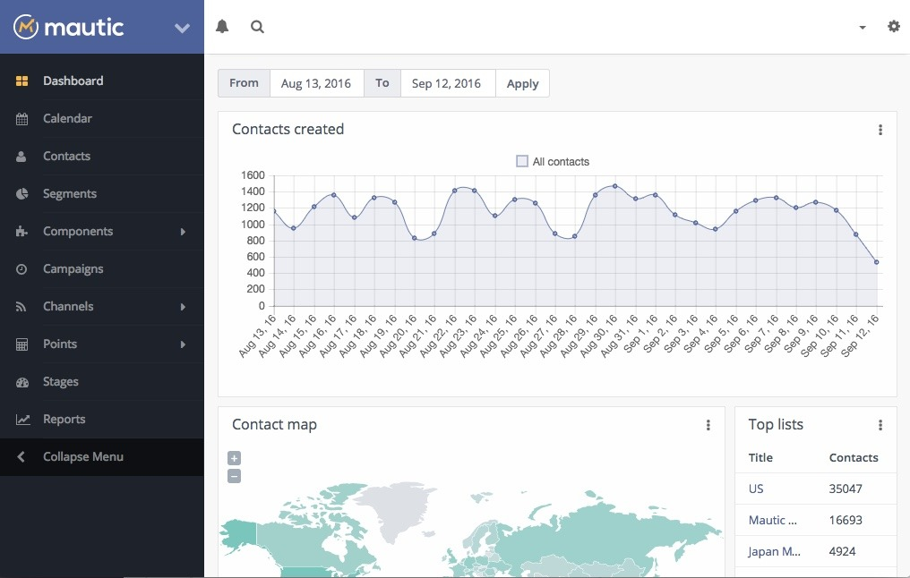

<!--
Este archivo README esta generado automaticamente<https://github.com/YunoHost/apps/tree/master/tools/readme_generator>
No se debe editar a mano.
-->

# Mautic para Yunohost

[](https://ci-apps.yunohost.org/ci/apps/mautic/)


[](https://install-app.yunohost.org/?app=mautic)

*[Leer este README en otros idiomas.](./ALL_README.md)*

> *Este paquete le permite instalarMautic rapidamente y simplement en un servidor YunoHost.*  
> *Si no tiene YunoHost, visita [the guide](https://yunohost.org/install) para aprender como instalarla.*

## Descripción general

Marketing Automation Software

With Mautic, website visitors can be tracked and converted into identified contacts using forms. Anonymous and identified contacts can be divided into segments and assigned to campaigns - either on the basis of segments or forms. These campaigns contain workflows to provide the contacts with further information and advertising material or to organize the contacts

**Versión actual:** 5.2.2~ynh1

**Demo:** <https://www.mautic.org/demo>

## Capturas



## Documentaciones y recursos

- Sitio web oficial: <https://www.mautic.org/>
- Documentación administrador oficial: <https://docs.mautic.org/en>
- Repositorio del código fuente oficial de la aplicación : <https://github.com/mautic/mautic>
- Catálogo YunoHost: <https://apps.yunohost.org/app/mautic>
- Reportar un error: <https://github.com/YunoHost-Apps/mautic_ynh/issues>

## Información para desarrolladores

Por favor enviar sus correcciones a la [rama `testing`](https://github.com/YunoHost-Apps/mautic_ynh/tree/testing).

Para probar la rama `testing`, sigue asÍ:

```bash
sudo yunohost app install https://github.com/YunoHost-Apps/mautic_ynh/tree/testing --debug
o
sudo yunohost app upgrade mautic -u https://github.com/YunoHost-Apps/mautic_ynh/tree/testing --debug
```

**Mas informaciones sobre el empaquetado de aplicaciones:** <https://yunohost.org/packaging_apps>
